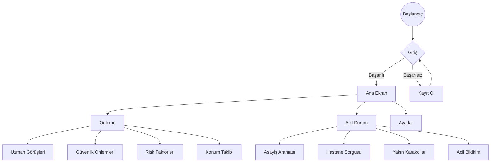
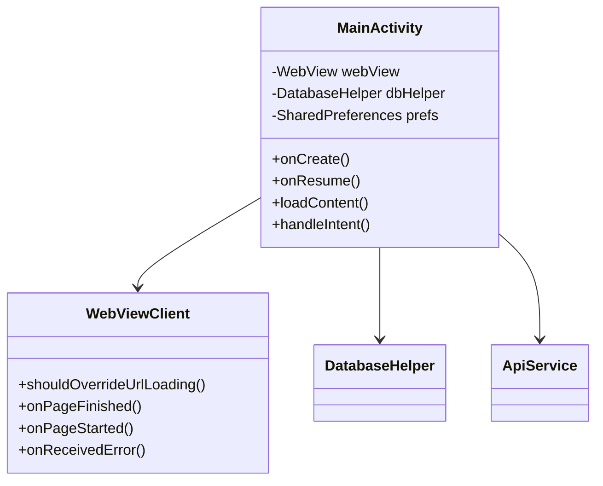

# Çocuk Kaybolmalarında Veli Yardımcısı

Bu proje, Trakya Üniversitesi Bilgisayar Teknolojileri Bölümü bitirme projesi olarak geliştirilmiştir.
Proje Raporu :
* https://github.com/ck-cankurt/android_bitirme_proje/blob/c299453576ef184325a31197b39626f7c3710e42/docs/SON_RAPOR_Redaksiyon.pdf

## İstatistiksel Analiz

### Kayıp Çocuk İstatistikleri Dashboard'u


## Uygulama Mimarisi ve Akış

### Kullanıcı Akış Şeması


### Sistem Mimarisi


### Performans Metrikleri


## Özellikler

### Önleme Modülü
- Uzman görüşleri ve tavsiyeleri
- Güvenlik önlemleri rehberi
- Risk faktörleri analizi
- Gerçek zamanlı konum takibi
- Güvenli bölge tanımlama

### Acil Durum Modülü
- Hızlı bildirim sistemi
- Asayiş.gov.tr entegrasyonu
- E-devlet ve SABİM entegrasyonu
- Hastane sorgulama
- Yakın karakol/hastane haritası
- SOS butonu

### Raporlama
- İstatistiksel analizler
- Durum takibi
- PDF rapor oluşturma
- Veri senkronizasyonu

## Teknik Detaylar

### Geliştirme Ortamı
- Android Studio 1.5
- Java SE Development Kit 8u77
- Minimum Android API: 16 (4.1.2)
- WebView komponenti
- Material Design UI

### Veritabanı
- SQLite
- Offline-first yaklaşımı
- Veri senkronizasyonu

### API Entegrasyonları
- Asayiş.gov.tr API
- E-devlet API
- SABİM API
- Google Maps API

## Proje Yapısı

```
├── app/
│   ├── src/
│   │   ├── main/
│   │   │   ├── java/
│   │   │   ├── res/
│   │   │   └── AndroidManifest.xml
│   │   └── test/
│   └── build.gradle
├── docs/
│   ├── api/
│   ├── architecture/
│   └── user-guide/
├── assets/
│   └── images/
└── README.md
```

## Katkıda Bulunanlar

- Can KURT
- Trakya Üniversitesi Bilgisayar Teknolojileri Bölümü

## Lisans

Bu proje akademik bir çalışmadır. Tüm hakları saklıdır.
